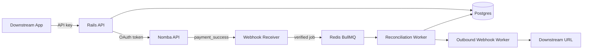

# Rails Architecture and Security Note

Rails is a Fastify/TypeScript API plus BullMQ worker that turns Nomba virtual-account transfers into customer-level ledger entries.

## Architecture



The API handles customer creation, Nomba virtual-account provisioning, transaction history, statements, and webhook subscription management. The worker handles reconciliation and outbound webhook delivery so Nomba webhook requests can return quickly.

## Data Handling

The core tables are:

- `customers`: downstream customer/student records and Rails-owned expected amount.
- `virtual_accounts`: Nomba virtual account mappings.
- `transactions`: reconciled inbound Nomba transfers.
- `reconciliation_events`: immutable audit trail for state changes.
- `api_keys`: SHA-256 hashes of downstream API keys.
- `outbound_webhook_subscriptions`: downstream callback URLs and event filters.
- `outbound_webhook_delivery_log`: delivery attempts, responses, signatures, and status.

Amounts are converted to integer kobo before reconciliation to avoid decimal precision drift.

## Inbound Webhook Security

Rails verifies every Nomba webhook before enqueueing work. The HMAC-SHA256 payload is:

```text
event_type:requestId:userId:walletId:transactionId:type:time:responseCode:nomba-timestamp
```

The generated Base64 signature is compared with `nomba-signature` using a timing-safe comparison. Invalid signatures receive `401` and are not queued.

## API-Key Security

Downstream apps authenticate with `Authorization: Bearer <key>` or `X-API-Key`. Rails only stores SHA-256 hashes and a non-secret prefix. Plaintext keys are returned once at creation time.

## Idempotency

Inbound transfers are deduplicated by Nomba `transactionId` and `sessionId`. Provisioning is idempotent at the customer level: if a customer already has an active virtual account, Rails returns it instead of creating another one.

## Outbound Webhook Security

Rails signs outbound webhooks with `RAILS_WEBHOOK_SECRET`. The signature payload is:

```text
rails-timestamp:rails-event-id:rails-event-type:body
```

Deliveries include:

- `rails-event-id`
- `rails-event-type`
- `rails-signature`
- `rails-signature-algorithm`
- `rails-signature-version`
- `rails-timestamp`

Delivery attempts and responses are persisted for auditability and retries.

## Reliability

Nomba webhook ingestion returns `200` after verification and enqueueing, avoiding repeated Nomba retries during normal operation. BullMQ retries reconciliation and outbound webhook delivery with exponential backoff. Database unique constraints enforce idempotency even if workers retry.

## Sensitive Configuration

Never commit real values for:

- `DATABASE_URL`
- `REDIS_URL`
- `NOMBA_CLIENT_ID`
- `NOMBA_CLIENT_SECRET`
- `NOMBA_PARENT_ACCOUNT_ID`
- `NOMBA_WEBHOOK_SECRET`
- `RAILS_WEBHOOK_SECRET`
- `ADMIN_BOOTSTRAP_TOKEN`
