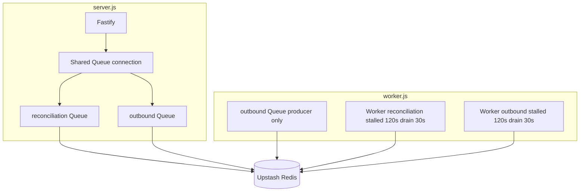

# BullMQ / Redis Usage Audit

## Executive summary

Idle Redis command spikes on Upstash Free are caused by **BullMQ Workers polling and running stalled-job checks 24/7**, not by the `/health` endpoint or Fastify boot alone.

On Render Free the start command runs **both** `worker.js` and `server.js` in one container. Each Worker maintains blocking Redis connections and periodic `stalled-check` timers even when the queue is empty.

## Inventory (before optimization)

| Symbol | Location | Notes |
|--------|----------|-------|
| `new Queue(...)` ×2 | `src/queues.ts` via `createQueueServices` | API process |
| `new Queue(...)` ×2 | `src/worker.ts` via `createQueueServices` | **Duplicate** queue clients in worker process |
| `new Worker(...)` ×2 | `src/worker.ts` | Reconciliation + outbound delivery |
| `new Redis(...)` ×1 | `src/queues.ts` `isRedisAvailable` | Ephemeral ping on API boot only |
| `QueueEvents` | — | **Not used** |
| `QueueScheduler` | — | **Not used** |
| `FlowProducer` | — | **Not used** |
| Repeatable / cron jobs | — | **Not used** |
| `setInterval` | — | **Not used** (BullMQ internal timers only) |

## Answers

### Are workers started during Fastify boot?

**No.** Workers are only created in `src/worker.ts`. Fastify (`src/server.ts`) only creates **Queue producers** when `REDIS_URL` is set and Redis ping succeeds.

### Are workers inside the API process?

**No**, but Render runs both processes in one container:

```text
sh -c "node dist/src/worker.js & node dist/src/server.js"
```

So the container always hosts 2 Workers even at zero traffic.

### Duplicate workers?

**No duplicate Worker instances**, but **duplicate Queue clients**: API and worker each call `createQueueServices`, creating 4 Queue objects and 4+ Redis connections total.

### Multiple Redis connections?

**Yes.** Before optimization:

- API: 2 Queue connections + 1 boot ping
- Worker: 2 Queue connections + 2 Worker connections (each Worker uses 1–2 Redis connections internally)

Estimated **5–8 persistent Redis connections** idle at all times.

### QueueEvents instantiated more than once?

**No** — not used anywhere.

### Workers running with no jobs?

**Yes.** BullMQ Workers block-wait on Redis and run `stalled-check` on an interval (default **every 30s per Worker**). Upstash keys like `bull:rails-reconciliation:stalled-check` confirm this.

## Estimated idle Redis command sources (before)

| Source | Interval | Commands / day (approx.) |
|--------|----------|--------------------------|
| Stalled check ×2 workers | 30s | **~5,760+** |
| Empty-queue polling (`drainDelay` 5s) ×2 | 5s | **~34,000+** |
| Lock renewal / metadata | varies | hundreds–thousands |
| **Total idle (no jobs)** | | **~40k–50k+/month quickly** |

This matches hitting Upstash Free limits with no user traffic.

## Architectural recommendations

| Option | Redis idle cost | Reliability | Fit for Rails MVP |
|--------|-----------------|-------------|-------------------|
| **Inline async processor (default)** | **~0** (no Redis) | Retries via in-process backoff + DB idempotency | **Best for Render Free + Upstash Free** |
| Optimized BullMQ (tuned workers) | **~85–95% lower** | Full BullMQ retries | Good if Redis is required |
| Separate API / worker services | Same per worker, but API-only scaling | Production pattern | Ideal on paid Render |
| pg-boss (Postgres jobs) | No Redis | Strong | Future option; adds migration scope |
| Remove BullMQ entirely | 0 | Inline only | Acceptable at hackathon scale |

**Verdict:** BullMQ is not excessive for production scale, but **it is excessive for a low-traffic free-tier deployment**. Inline processing preserves webhook fast-ack, idempotency, and outbound retries without idle polling.

## Optimizations implemented

1. **`JOB_PROCESSOR=inline` (default)** — API processes jobs in-process; **no Redis required** for webhooks.
2. **`JOB_PROCESSOR=bullmq`** — opt-in BullMQ with tuned worker settings.
3. **Shared Redis connections** for Queue clients (one connection per process role).
4. **Worker-only outbound Queue** in worker process (removed duplicate reconciliation Queue).
5. **Tunable BullMQ idle settings** via `BULLMQ_STALLED_INTERVAL_MS`, `BULLMQ_DRAIN_DELAY_MS`.
6. **`BULLMQ_WORKERS_ENABLED=false`** — worker entrypoint exits without connecting to Redis.
7. **Render start command** documented for API-only inline mode.

## Estimated savings

| Optimization | Approx. savings |
|--------------|-----------------|
| Inline processor (default) | **~99%** of Redis commands (boot ping only if Redis URL set for other reasons) |
| Inline + remove worker from start cmd | **100%** Redis on API-only deploy |
| BullMQ tuned stalled interval (30s → 120s) | **~75%** of stalled-check commands |
| BullMQ tuned drain delay (5s → 30s) | **~83%** of empty-queue poll commands |
| Shared Queue connection | **~2 fewer connections**, fewer duplicate metadata ops |
| Worker: 1 Queue instead of 2 | **~50%** queue-side idle ops in worker process |

## Architecture diagrams

### Before

```mermaid
flowchart TB
  subgraph render [Render Free Container]
    api[server.js Fastify]
    worker[worker.js]
    api --> q1[Queue reconciliation]
    api --> q2[Queue outbound]
    worker --> q3[Queue reconciliation duplicate]
    worker --> q4[Queue outbound duplicate]
    worker --> w1[Worker reconciliation]
    worker --> w2[Worker outbound]
  end
  redis[(Upstash Redis)]
  q1 --> redis
  q2 --> redis
  q3 --> redis
  q4 --> redis
  w1 -->|"poll + stalled-check 24/7"| redis
  w2 -->|"poll + stalled-check 24/7"| redis
  health[/health] -.->|"no Redis"| api
```

### After (recommended: inline)

```mermaid
flowchart TB
  subgraph render [Render Free Container]
    api[server.js Fastify]
    api --> inline[Inline Job Processor]
    inline --> recon[reconcileNombaWebhook]
    inline --> out[deliverOutboundWebhook + retry]
  end
  db[(Postgres)]
  recon --> db
  out --> db
  health[/health] -.-> api
```

### After (optional: optimized BullMQ)


